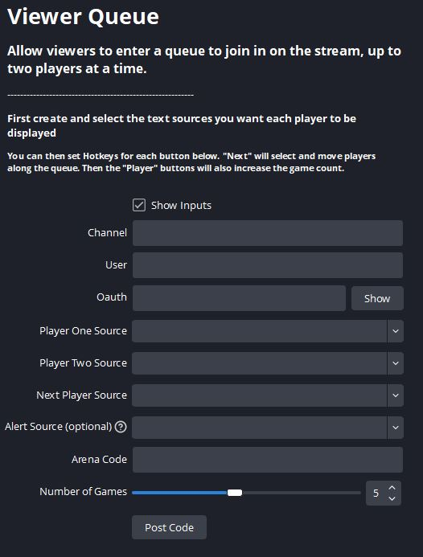

# OBS Viewer Queue
Allows stream viewers to enter a queue, where their names will then be displayed on screen. This programme was made for Smash Bros so there is also a counter that you can increment for each game that they play. It can also be used with streambots/programmes like "Mix It Up", to automatically cycle the queue and send messages in chat.

# How to use
Once downloaded, add the **"Queue_v3.py"** file to your OBS "Scripts" tabs which can be found under "Tools". 

